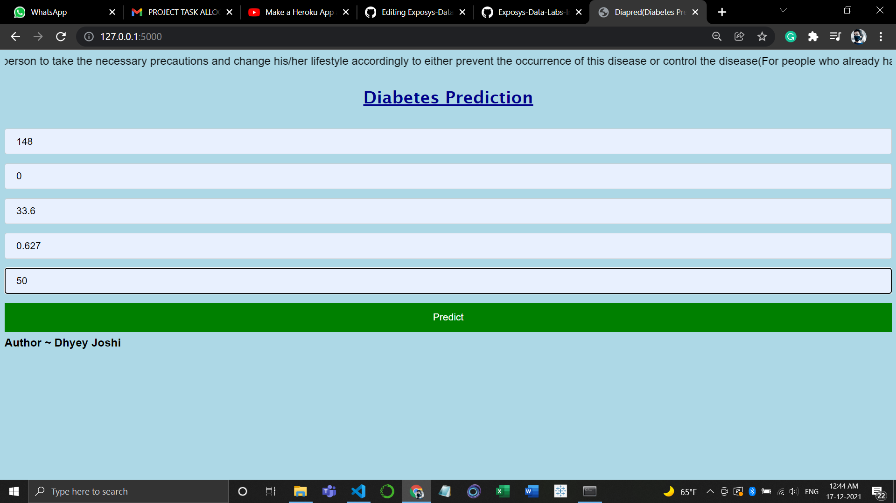
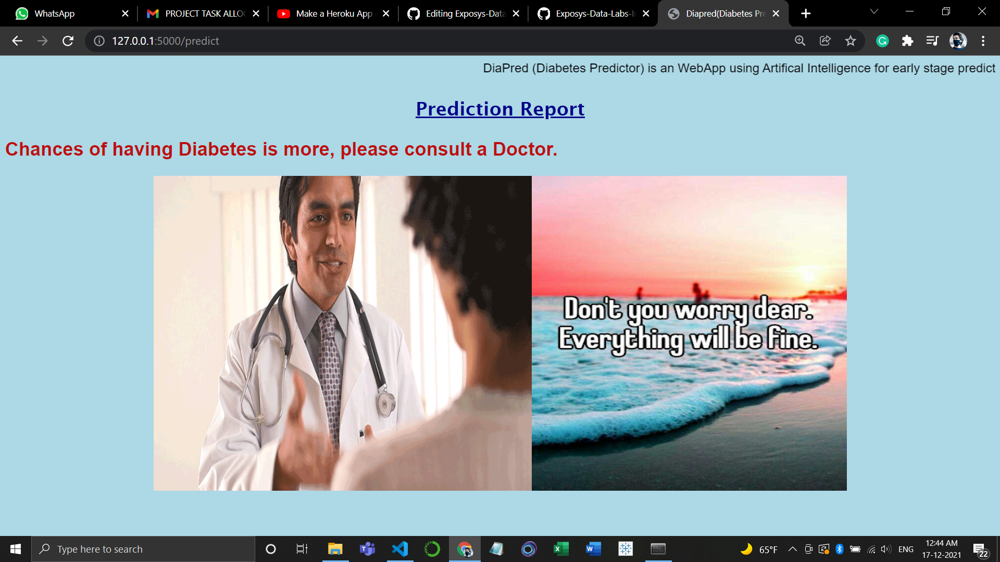
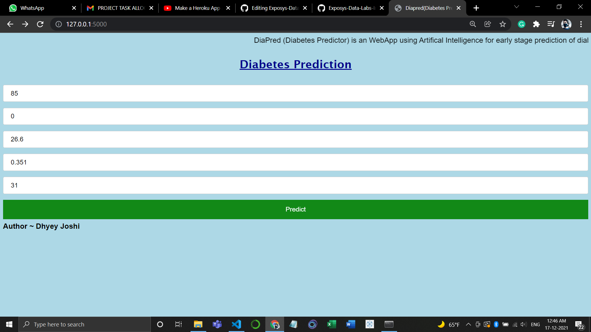
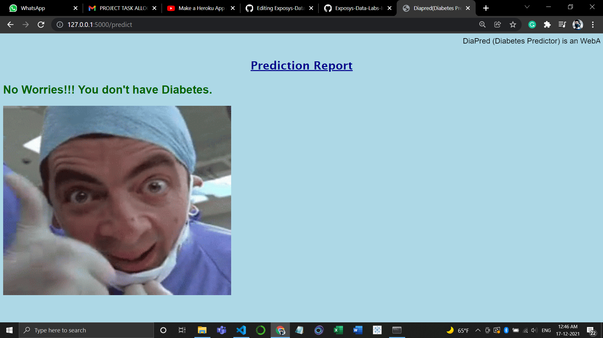

# DIAPRAD
Diabetes Prediction using Machine Learning &  Ensemble Learning
<b><pre>
Algoritms:
1.SVM
2.K Nearest Neighbor
3.Naive Bayes
4.Logistic Regression
5.RandomForest Classifier
6.AdaBoost
7.XGboost
8.Gradient Boost
9.LightGBM
10.Extra Tree Classifier</pre><b>

